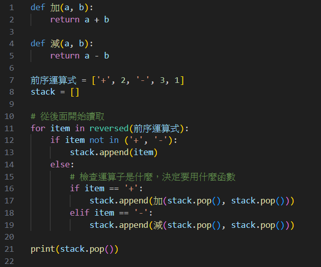

## 解題思路
### 關鍵字: 前序運算式

有兩個做法:
1. 從右至左讀取運算式，用 stack 保存中間資料
2. 遞迴

這題其實就是在處理前序運算式

回想一下前序運算式長怎樣? 怎麼做? 想不起來就想一下後序運算式你是怎麼做的。

在後序運算式中......
- 你會由左至右讀取資料
- 檢查讀到的資料內容，如果是數字就先入棧
- 如果是運算子就先確認運算子是什麼，決定要用什麼方式計算
- 決定好後依序從棧頂把數字取出來計算

在前序運算式中......
- 你會由右至左讀取資料
- 檢查讀到的資料內容，如果是數字就先入棧
- 如果是運算子就先確認運算子是什麼，決定要用什麼方式計算
- 決定好後依序從棧頂把數字取出來計算

判斷運算子其實就相當於在判斷你要使用什麼函式進行計算，像這樣，我用 python 表示

~~我有罪，我使用中文變量名，可是在 python 能正常執行，主要是方便理解，但還是建議沒事別這樣做~~

那換到這題也是一樣的，讀取時你一樣要判斷要用什麼函式計算，不過這題是升級版的，傳入參數並非像加減乘除那樣，都固定傳 2 個數字進去

如果你會前序運算式的算法了，那這題就只需要解決不同函式需要傳入不同數量的參數的問題而已

### 總結:
對於前序運算式的處理方式，我知道的有兩種
- 建立一個 stack，從右往左讀取
- 使用遞迴，從左至右讀取

這邊簡單示範 stack 的作法，遞迴就自己想吧

## 類題
- [c382. 加減乘除](https://zerojudge.tw/ShowProblem?problemid=c382)(簡單)
- [f698. 後序運算式求值](https://zerojudge.tw/ShowProblem?problemid=f698)(先備知識)
- [f377. 運算式轉換](https://zerojudge.tw/ShowProblem?problemid=f377)(先備知識)
- [a017. 五則運算](https://zerojudge.tw/ShowProblem?problemid=a017)(大魔王)
- [a664. 四則運算](https://zerojudge.tw/ShowProblem?problemid=a664)(新的挑戰)
- [f640. 函數運算式求值](https://zerojudge.tw/ShowProblem?problemid=f640)(前序運算式_進階版)

## 解題紀錄
### v1-1 AC(19ms, 3.3MB)
- 使用 stack 由右至左讀取

### v1-2 AC(18ms, 3.3MB)
- 使用 python 特有的三元運算式

### v2-1 AC(18ms, 3.3MB)
- 使用遞迴解題
