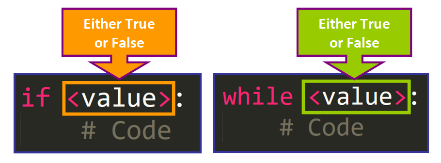

## 題目
實作一個函數`isAscendingSequence(n)`，其輸入參數`n`為一個僅包含整數(`int`)的列表(`list`)，該函數需要回傳一個布林值(`bool`)用以判斷整數列表`n`是否為「**遞增數列**」？若一個整數列表至少包含一個整數，且對於所有整數皆大於其前一項（如果存在的話）的整數，則我們稱該整數列表為「**遞增數列**」。

有鑑於上一次的經驗，Alice 和 Bob 這次決定先核對彼此所撰寫的函數是否會有相同的回傳值，他們將由 Alice 所完成的函數重新命名為`isAscendingSequenceAlice(n)`，而由 Bob 所完成的函數則是重新命名為`isAscendingSequenceBob(n)`，並且共同撰寫另一個函數`checkReturnValuesAreSame(n)`用以判斷對於輸入參數`n`來說兩者是否有相同的回傳值。

```python
from typing import List

# Alice version
def isAscendingSequenceAlice(n: List[int]) -> bool:
    if not n:
        return False
    for i in range(1, len(n)):
        if n[i-1] >= n[i]:
            return False
    return True

# Bob version
def isAscendingSequenceBob(n: List[int]) -> bool:
    return n and all(a < b for a, b in zip(n, n[1:]))

# Checks if two functions have the same return value
def checkReturnValuesAreSame(n: List[int]) -> bool:
    return isAscendingSequenceAlice(n) == isAscendingSequenceBob(n)
```

> 只有一個人的算法是正確的，請標記出誰的寫法是正確的。

> 並輸出一個數列，數列由或多個「數字」所組成，彼此使用單一空白字元做分隔，「數字」的定義為連續的阿拉伯數字 0123456789 ，所有的「數字」轉換成 Python 整數型態時其值需介於$[0, 2^{32}]$範圍之內，該數列所含「數字」個數即數列長度不應超過$100$，且當該數列作為整數列表`n`輸入`checkReturnValuesAreSame(n)`時，會使得該函數的回傳值為`False`。

## 輸出答案的範例格式
```text
Alice
1 2 3 4 5
```

具體來說, 用python應該這樣輸入
```python
print('Alice\n1 2 3 4 5', end='')
```
而不是這樣
```py
print('Alice')
print('1 2 3 4 5')
```

他們輸出的內容是不一樣的

## 解題思路

Alice 的寫法才是正確的，雖然兩者都能判斷一個整數數列是否為遞增數列，但只有 Alice 的版本做了排他處理，Bob 沒有針對當列表`list`為空的情況做處理，或者說有，但做法不太正確。

當列表的內容為空時，Alice 的函數能正常輸出一個布爾值`False`，Bob 的函數卻輸出一個空列表`[]`

```py
data = []

print(isAscendingSequenceAlice(data))   # 輸出 False
print(isAscendingSequenceBob(data))     # 輸出 []
```

那麼 Bob 的函數出了什麼問題? 使用了邏輯運算子 `Logic Operators`，卻得不到布林值 boolean

Bob 的函數可以分成 2 個部分，以 `and` 為界
- 第一部分: `and` 前的 `n`
- 第二部分: `and` 後的 `all(a < b for a, b in zip(n, n[1:]))`

第一部分是沒問題的，傳入一個空列表`list`當布林值`bool`使用，會被視為`False`

```py
n = []
if n:
    print(True)
else:
    print(False)

# 輸出 False
```

第二部分傳入一個空列表`list`，會得到True的結果

```py
n = []
result = all(a < b for a, b in zip(n, n[1:]))
print(result)

# 輸出 True
```

不過根據邏輯運算子的短路求值特性， 當and前的值為`False`時，就會直接輸出`False`了，所以後面無所謂......hmmmmm

```py
if [] and True:
    print(True)
else:
    print(False)

# 輸出 False
```

...

......

.........

Huh????

不對，讓我再試試，直接`print()`

```py
print([] and False)

# 輸出 []
```

Got you!

### 找到問題了

`[] and False` 實際上返回的值並非傳統意義上的布林值，但這個值會被 `if` 視作與 `False` 等價的東西。

那麼這個值究竟是什麼?

答案是 `[]`，這傢伙直接放到邏輯判斷裡面得到的不是 `True` 或 `False`，而是其他東西。

### `and` 邏輯運算子發生短路求值時，並非返回一個布林值，而是返回「在他前面的那個值」，原本長怎樣，就原封不動地丟出來。

這就是為什麼 `print([] and False)` 會輸出 `[]` 而非 `False`的真正原因。

### Truthy 和 Falsy

`[]`在邏輯判斷中，實際上被視作 `Falsy`，而非 `False`，盡管他們等價，實際上卻是不同東西。

在 Python 的邏輯運算中，決定一個值是否為真值的條件並非只取決於該值是否為 `True`，還會考慮 `Truthy`

基本規則如下
- 評估為 False 的值被視為 `**Falsy**`
- 評估為 True 的值被視為 `**Truthy**`

當我們使用邏輯判斷時，實際上是在調用 **boolean context**

`boolean context`可以視為是一個物件(應該?)，要求其值必須是`True`或`False`

大概是下面這樣:


### 會被視為是`Falsy`的值

除了False外，其他都是Falsy

|類型|說明|
|---|---|
|序列或集合<br>Sequences<br>Collections|空的列表: `[]`<br>空的元組: `()`<br>空的字典: `{}`<br>空的集合: `set()`<br>空的字串: `''`<br>空的ranges: `range(0)`|
|數字<br>Numbers|任何數字類型的0<br>整數interger: `0`<br>浮點數float: `0.0`<br>複數complex: `0j`<br>科學記號: `0e0`(其實也被視作浮點數)|
|常量<br>Constants|`None`<br>`False`|

### 會被視為是`True`的值
根據[Python官方文檔](https://docs.python.org/zh-tw/3/library/stdtypes.html#truth-value-testing)的說明

> 預設情況下，「**物件**」會被視為是True

Truthy的值包含
- 非空序列或集合(列表list, 元祖tuple, 字符串string, 字典dict, 集合set)
- 不為0的數值(Numeric values that are not zero)

說人話就是不管放什麼進去，只要不在`Falsy`名單內的都是`Truthy`

### `bool()`函數
我們可以透過內建函數`bool()`取得任意物件的 **bool 值**，並返回`True`或`False`，例如:

```py
print(bool(123))

# 返回 True
```

### 修正 Bob 的函數
如果希望 Bob 的函數能返回正確的值，可以透過`bool()`函數，讓他的函數一定能返回bool類型的值(True, False)，而非什麼 `[]`

```py
def isAscendingSequenceBob(n) -> bool:
    return bool(n) and all(a < b for a, b in zip(n, n[1:]))

test = []
print(isAscendingSequenceBob(test))

# 輸出 False
```

## 參考資料

- [Truthy and Falsy Values in Python: A Detailed Introduction](https://www.freecodecamp.org/news/truthy-and-falsy-values-in-python/) | [freeCodeCamp](https://www.freecodecamp.org/news/) 2024-08-21 [2024-08-21]
- [What is Truthy and Falsy? How is it different from True and False?](https://stackoverflow.com/questions/39983695/what-is-truthy-and-falsy-how-is-it-different-from-true-and-false) | [StackOverflow](https://stackoverflow.com/) 2016-10-11 [2024-08-21]
- [Truthy 與 Falsy](https://medium.com/vicky-notes/truthy-%E8%88%87-falsy-c795dfbd7dda) | [宅宅薇琪 \[前端學習筆記\]](https://medium.com/vicky-notes) | [Medium](https://medium.com/) 2021-02-05 [2024-08-21]
- [Built-in Types — Python 3.12.5 documentation](https://docs.python.org/3/library/stdtypes.html#truth-value-testing) | [Python](https://www.python.org/) 2024-08-21 [2024-08-21]